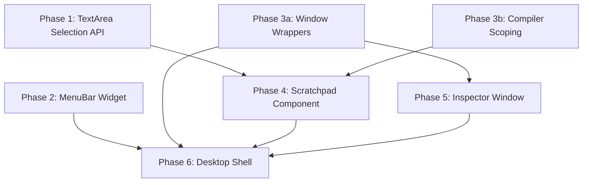

# feat: Smalltalk-Style IDE Refactor

## Overview

Refactor MaggieIDE from a fixed two-panel REPL+Inspector layout into a traditional Smalltalk-style windowed desktop with scratchpads, floating inspectors, and a menu bar. This is a bottom-up build: Yutani framework primitives first (TextArea selection, MenuBar widget), then Maggie IDE components on top.

## Problem Statement

The current MaggieIDE (`lib/yutani/ide/MaggieIDE.mag`) is a two-panel layout where the left panel is a line-by-line REPL and the right is an inspector. This model is limiting:

- Cannot select and evaluate arbitrary regions of text
- Only one inspector at a time, docked in place
- No windowed environment — cannot arrange tools freely
- No menu system for discoverability
- All scratchpads would share a single global scope

## Proposed Solution

A windowed desktop environment following classic Smalltalk IDE conventions:

1. **Desktop shell** — WindowManager root with MenuBar, launches to empty desktop
2. **Scratchpad windows** — Multi-line TextArea with Emacs-style selection + Smalltalk eval keybinds (Ctrl+D/P/I)
3. **Inspector windows** — Floating slot browser with mini evaluator, in-place navigation
4. **Menu bar** — Proper Yutani widget for File > New Scratchpad, Quit

## Technical Approach

### Architecture

```
MaggieDesktop (IDEToolBase subclass)
├── YutaniWindowManager (root widget)
│   ├── MenuBar (fixed at top)
│   │   ├── Menu "File"
│   │   │   ├── MenuItem "New Scratchpad" (Ctrl+N)
│   │   │   └── MenuItem "Quit" (Ctrl+Q)
│   │   └── Menu "Tools" (future)
│   ├── Window "Scratchpad 1"
│   │   └── ScratchpadComponent
│   │       └── YutaniTextArea (with selection API)
│   ├── Window "Scratchpad 2"
│   │   └── ScratchpadComponent
│   └── Window "Inspector: anArray"
│       └── InspectorWindow
│           ├── YutaniList (slot list, top)
│           └── YutaniInputField (mini evaluator, bottom)
└── Single event loop (session run)
```

**Critical constraint:** Single event loop architecture. One `session run`, one `stopEventLoop` in the quit handler only. All windows share one Yutani session. (Per documented learning in `docs/solutions/architecture-issues/yutani-multi-panel-event-loop.md`.)

### Implementation Phases

---

#### Phase 1: Yutani TextArea Selection API

**Goal:** Expose tview's existing TextArea cursor/selection capabilities through Yutani's gRPC layer.

**Repo:** `~/dev/go/yutani`

##### 1a. Proto definitions

**File:** `api/proto/industries/loosh/yutani/v1/textarea.proto` (new)

New `TextAreaService` with these RPCs:

```protobuf
service TextAreaService {
  rpc GetCursorPosition(TextAreaGetCursorRequest) returns (TextAreaGetCursorResponse);
  rpc SetCursorPosition(TextAreaSetCursorRequest) returns (TextAreaSetCursorResponse);
  rpc GetSelection(TextAreaGetSelectionRequest) returns (TextAreaGetSelectionResponse);
  rpc SetSelection(TextAreaSetSelectionRequest) returns (TextAreaSetSelectionResponse);
  rpc GetSelectedText(TextAreaGetSelectedTextRequest) returns (TextAreaGetSelectedTextResponse);
  rpc InsertTextAtCursor(TextAreaInsertTextRequest) returns (TextAreaInsertTextResponse);
}
```

Messages needed:
- Cursor position: `row` (int32), `column` (int32)
- Selection: `start_row`, `start_column`, `end_row`, `end_column`
- Insert: `text` (string) — inserts at current cursor position

Also extend `TextAreaProperties` in `types.proto` (line 251) with:
- `optional bool selection_enabled = 7;` — enables mark/selection mode

##### 1b. Server-side implementation

**File:** `pkg/services/textarea.go` (new)

Implement each RPC by calling through to tview's `TextArea` methods:
- `GetCursor()` → `GetCursorPosition` RPC
- `Select(startRow, startCol, endRow, endCol)` → `SetSelection` RPC
- tview's `GetSelection()` → `GetSelection` RPC
- For `GetSelectedText`: use `GetSelection()` bounds + `GetText()` to extract substring
- For `InsertTextAtCursor`: get cursor pos, get full text, splice in new text, set text, restore cursor

**File:** `pkg/server/server.go` — register TextAreaService

**File:** `cmd/yutani/main.go` — wire up service

##### 1c. Key event interception

**Critical issue identified by SpecFlow:** tview's TextArea has its own key handling. When the user presses Ctrl+D, tview may process it (delete char under cursor) AND Yutani may forward it as an event. This dual-action problem breaks the evaluation keybind architecture.

**Investigation needed:** Write a test to determine event flow behavior:
1. Create a TextArea with some text
2. Register `onKey:` handler in Maggie
3. Press Ctrl+D
4. Check: did the TextArea delete a character? Did the handler fire? Both?

**Possible solutions (choose based on test results):**
- **Option A:** Add a `key_filter` property to TextArea that suppresses specified key combos from widget processing, forwarding them only as events
- **Option B:** Add a global key intercept layer in the event system that captures keys before widget dispatch
- **Option C:** If tview already forwards all keys as events regardless of widget handling, we just need to undo the widget's side effects (fragile)

**Recommendation:** Option A is cleanest. Add `repeated string suppressed_keys = 8;` to TextAreaProperties. Keys matching this list are not processed by the widget but still emitted as events.

##### 1d. Maggie wrapper updates

**File:** `lib/yutani/widgets/YutaniTextArea.mag` — add methods:
- `cursorPosition` → calls GetCursorPosition RPC
- `setCursorRow: r column: c` → calls SetCursorPosition RPC
- `selection` → calls GetSelection RPC (returns dictionary with start/end)
- `setSelectionFrom: start to: end` → calls SetSelection RPC
- `selectedText` → calls GetSelectedText RPC
- `insertAtCursor: text` → calls InsertTextAtCursor RPC
- `suppressKeys: anArray` → sets suppressed_keys property
- `enableSelection` → sets selection_enabled property

##### 1e. Run proto generation

```bash
cd ~/dev/go/yutani && make proto
```

##### 1f. Tests

- Unit tests in `pkg/services/textarea_test.go`
- Headless integration test via TestService: create TextArea, inject text, set selection, verify GetSelectedText returns correct substring
- Test InsertTextAtCursor: verify text is spliced correctly at various positions (start, middle, end)
- Test key suppression: verify suppressed keys don't modify TextArea content but still emit events

**Acceptance criteria:**
- [x] `GetCursorPosition` returns correct row/column after text input
- [x] `SetSelection` visually highlights the specified range
- [x] `GetSelectedText` returns exactly the text within the selection bounds
- [x] `InsertTextAtCursor` inserts text at cursor without disturbing surrounding content
- [x] Suppressed keys emit events but don't trigger TextArea widget behavior
- [x] All RPCs work while the event loop is running (no blocking)

---

#### Phase 2: Yutani MenuBar Widget

**Goal:** Add MenuBar, Menu, and MenuItem widget types to Yutani.

**Repo:** `~/dev/go/yutani`

##### 2a. Proto definitions

**File:** `api/proto/industries/loosh/yutani/v1/types.proto` — add to WidgetType enum:
```protobuf
WIDGET_MENU_BAR = 20;
WIDGET_MENU = 21;
WIDGET_MENU_ITEM = 22;
```

Add property messages:
```protobuf
message MenuBarProperties {
  optional Color background_color = 1;
  optional Color text_color = 2;
  optional Color active_background_color = 3;
  optional Color active_text_color = 4;
}

message MenuProperties {
  optional string title = 1;
}

message MenuItemProperties {
  optional string label = 1;
  optional string shortcut_display = 2;  // e.g., "Ctrl+N" — display only, not functional
  optional bool separator = 3;           // if true, renders as a divider line
  optional bool disabled = 4;
}
```

Add to WidgetProperties oneof:
```protobuf
MenuBarProperties menu_bar = 40;
MenuProperties menu = 41;
MenuItemProperties menu_item = 42;
```

Add to WidgetEventType:
```protobuf
WIDGET_MENU_ITEM_SELECTED = 20;
```

**File:** `api/proto/industries/loosh/yutani/v1/menu.proto` (new)

```protobuf
service MenuService {
  rpc AddMenu(MenuAddMenuRequest) returns (MenuAddMenuResponse);
  rpc AddMenuItem(MenuAddMenuItemRequest) returns (MenuAddMenuItemResponse);
  rpc RemoveMenuItem(MenuRemoveMenuItemRequest) returns (MenuRemoveMenuItemResponse);
}
```

##### 2b. Server-side implementation

**File:** `pkg/server/menu_bar.go` (new) — `MenuBarPrimitive`
- Renders as a horizontal bar of menu titles
- On click of a title: opens a dropdown list below it
- Dropdown is rendered as an overlay (similar to how Modal works in tview)
- Keyboard nav: Left/Right to switch menus, Up/Down within a menu, Enter to select, Escape to close
- Alt+letter for accelerator keys (if Alt is available)
- Click-away closes the dropdown

**File:** `pkg/server/menu.go` (new) — `MenuPrimitive`
- Container for MenuItems
- Renders as a vertical list when activated

**File:** `pkg/server/menu_item.go` (new) — `MenuItemPrimitive`
- Renders label + shortcut hint text
- Separator variant renders a horizontal line
- Disabled variant renders grayed out

**File:** `pkg/services/menu.go` (new) — MenuService implementation
**File:** `pkg/server/widget_factory.go` — add cases for WIDGET_MENU_BAR, WIDGET_MENU, WIDGET_MENU_ITEM

**Event emission:** When a MenuItem is clicked or Enter is pressed on it:
- Emit `WIDGET_MENU_ITEM_SELECTED` event with `data` containing:
  - `menu_bar_id`: the menu bar widget ID
  - `menu_id`: the parent menu widget ID
  - `menu_item_id`: the selected item widget ID
  - `label`: the item label text

**Focus behavior:**
- Activating the menu bar temporarily captures keyboard input
- Dismissing the menu (Escape, click-away, item selection) returns focus to the previously focused widget
- The menu bar itself should NOT steal persistent focus from windows below it

##### 2c. Maggie wrappers

**File:** `lib/yutani/widgets/YutaniMenuBar.mag` (new)
- `addMenu: aMenu` → calls MenuService.AddMenu RPC
- Style methods: `backgroundColor:`, `textColor:`, etc.

**File:** `lib/yutani/widgets/YutaniMenu.mag` (new)
- `title:` / `title` — get/set title
- `addItem: aMenuItem` → calls MenuService.AddMenuItem RPC
- `addSeparator` — creates a separator MenuItem and adds it

**File:** `lib/yutani/widgets/YutaniMenuItem.mag` (new)
- `label:` / `label` — get/set label
- `shortcutDisplay:` — set shortcut hint text (cosmetic only)
- `disabled:` / `isDisabled`
- `onSelected: aBlock` — register selection callback

**File:** `lib/yutani/YutaniSession.mag` — add to widget factory:
- Case for `WIDGET_MENU_BAR` → `YutaniMenuBar`
- Case for `WIDGET_MENU` → `YutaniMenu`
- Case for `WIDGET_MENU_ITEM` → `YutaniMenuItem`
- Add factory methods: `createMenuBar`, `createMenu`, `createMenuItem`

##### 2d. Tests

- Unit tests for MenuBarPrimitive rendering
- Headless test: create menu bar, add menus and items, simulate click on menu title, verify dropdown appears, simulate click on item, verify event emitted
- Test keyboard navigation: Left/Right between menus, Up/Down within menu, Enter to select, Escape to close
- Test focus restoration after menu dismissal

**Acceptance criteria:**
- [x] MenuBar renders horizontally at its position in the layout
- [x] Clicking a menu title opens a dropdown overlay
- [x] Clicking a menu item emits WIDGET_MENU_ITEM_SELECTED event and closes the dropdown
- [x] Escape closes the dropdown without selection
- [x] Keyboard navigation works (arrows + Enter)
- [x] Focus returns to the previous widget after menu dismissal
- [x] Separator items render as dividers and are not selectable
- [x] Disabled items render grayed out and are not selectable

---

#### Phase 3: Maggie Window Wrappers + Compiler Scoping

**Goal:** Create Maggie-side wrappers for Window/WindowManager and extend the Compiler with per-scope variable support.

**Repo:** `~/dev/go/maggie`

##### 3a. Window wrappers

**File:** `lib/yutani/widgets/YutaniWindow.mag` (new)

Methods wrapping WindowService RPCs:
- `title:` / `title` — set/get window title (via SetProperties)
- `move: x y: y` → WindowMove RPC
- `resize: w height: h` → WindowResize RPC
- `state` / `setState: aState` → WindowGetState/WindowSetState (#normal, #minimized, #maximized)
- `bringToFront` → WindowBringToFront RPC
- `sendToBack` → WindowSendToBack RPC
- `setConstraints: aDict` → WindowSetConstraints RPC (minWidth, minHeight, etc.)
- `movable:`, `resizable:`, `closable:`, `minimizable:`, `maximizable:` — property setters
- `onClosed: aBlock` — register WIDGET_WINDOW_CLOSED handler
- `onActivated: aBlock` — register WIDGET_WINDOW_ACTIVATED handler
- `onStateChanged: aBlock` — register WIDGET_WINDOW_STATE_CHANGED handler
- `setContent: aWidget` → WindowService set child widget

**File:** `lib/yutani/widgets/YutaniWindowManager.mag` (new)

Methods wrapping WindowService RPCs:
- `addWindow: aWindow` → WindowManagerAddWindow RPC
- `removeWindow: aWindow` → WindowManagerRemoveWindow RPC
- `windows` — list of managed windows
- `activeWindow` — currently focused window
- `zOrder` → WindowManagerGetZOrder RPC

**File:** `lib/yutani/YutaniSession.mag` — extend widget factory:
- Add cases for `WIDGET_WINDOW` → `YutaniWindow`
- Add cases for `WIDGET_WINDOW_MANAGER` → `YutaniWindowManager`
- Add factory methods: `createWindow`, `createWindowManager`

##### 3b. Compiler scoped evaluation

**File:** `vm/compiler_primitives.go` — add new primitive

Currently `evaluate:in:` (line 48) compiles code with `contextObject` as receiver. We need a new method that also injects local variable bindings:

```go
// Compiler evaluate:withLocals:
// Evaluates source code with a dictionary of local variable bindings.
// Locals shadow globals on read. Assignments write to local scope.
```

**Implementation approach:**
- Accept a Maggie Dictionary as the locals parameter
- Before compilation, inject local variable names into the compiler's scope
- After evaluation, extract any new/modified variables back into the Dictionary
- Read order: local scope → Compiler globals
- Write order: always write to local scope (unless explicitly using `Compiler setGlobal:to:`)

**File:** `vm/compiler.go` — may need modifications to support injecting variable bindings into the compilation context

**Alternative approach if compiler modification is complex:**
- Create a `ScratchpadScope` Maggie object that wraps a Dictionary
- Override `doesNotUnderstand:` to look up variable names in the Dictionary
- Use `Compiler evaluate: code in: scratchpadScope` so `self` is the scope object
- Variables accessed as `self x` or via the scope's method_missing
- **Downside:** Requires `self.` prefix for local variables, which is non-Smalltalk-like

**Recommendation:** Implement proper compiler-level scoping. The scratchpad scope is a core feature, not a hack.

**Maggie-side wrapper:**

**File:** `lib/yutani/ide/ScratchpadEnvironment.mag` (new)
```smalltalk
class: ScratchpadEnvironment [
    | locals |

    method: initialize [
        locals := Dictionary new
    ]

    method: evaluate: sourceCode [
        ^ Compiler evaluate: sourceCode withLocals: locals
    ]

    method: localAt: name [
        ^ locals at: name ifAbsent: [nil]
    ]

    method: localAt: name put: value [
        locals at: name put: value
    ]

    method: locals [
        ^ locals
    ]
]
```

##### 3c. Tests

- Test YutaniWindow: create window, set title, move, resize, verify state
- Test YutaniWindowManager: add windows, verify z-order, remove window
- Test `Compiler evaluate:withLocals:`: verify local variable reads, writes, shadowing globals
- Test scope isolation: two ScratchpadEnvironments don't share locals
- Test global fallthrough: scratchpad can read Compiler globals (class names, previously set globals)

**Acceptance criteria:**
- [x] `YutaniWindow` can be created, positioned, resized, and titled from Maggie code
- [x] `YutaniWindowManager` manages multiple windows with z-ordering
- [x] `Compiler evaluate:withLocals:` reads from locals, falls through to globals
- [x] Assignments in evaluated code write to the local scope dictionary
- [x] Two scopes with the same variable name don't interfere

---

#### Phase 4: Scratchpad Component

**Goal:** Build the scratchpad — a windowed text editor with Emacs selection and Smalltalk evaluation.

**Repo:** `~/dev/go/maggie`

##### 4a. ScratchpadComponent

**File:** `lib/yutani/ide/ScratchpadComponent.mag` (new)

```
ScratchpadComponent
├── textArea (YutaniTextArea) — multi-line editor with selection enabled
├── environment (ScratchpadEnvironment) — per-scratchpad scope
├── markSet (Boolean) — whether Ctrl+Space has been pressed
└── onInspect (Block) — callback when Ctrl+I fires, receives result object
```

**Initialization:**
- Create YutaniTextArea with `enableSelection` and `wordWrap: true`
- Set `suppressKeys:` to suppress Ctrl+D, Ctrl+P, Ctrl+I from TextArea widget processing
- Create ScratchpadEnvironment
- Register key event handler

**Key bindings (Emacs selection):**
- `Ctrl+Space` — toggle mark. If mark not set: call `SetSelection` with current cursor as start=end (mark set). If mark already set: clear selection (mark cleared).
- Navigation while mark is set extends selection: Ctrl+F/B/N/P/A/E, arrow keys — after each navigation key, update selection end to new cursor position via `SetSelection`
- `Ctrl+G` — cancel selection (clear mark, clear highlight)

**Key bindings (Smalltalk evaluation):**
- `Ctrl+D` (do it):
  1. Get selected text via `selectedText` (if no selection, get current line — to be determined)
  2. `environment evaluate: selectedText`
  3. If error: no visible feedback (Smalltalk convention for "do it")
  4. If success: result discarded, but variables persist in environment

- `Ctrl+P` (print it):
  1. Get selected text
  2. `result := environment evaluate: selectedText`
  3. If success: `textArea insertAtCursor: (String newline, result printString)`
  4. If error: `textArea insertAtCursor: (String newline, '!! ', error message)`

- `Ctrl+I` (inspect it):
  1. Get selected text
  2. `result := environment evaluate: selectedText`
  3. If success: fire `onInspect` callback with result
  4. If error: fire `onInspect` callback with the error object (inspect the error itself)

**Edge case — no selection:**
- When Ctrl+D/P/I is pressed with no active selection, evaluate the entire line the cursor is on
- Get cursor row via `cursorPosition`, extract that line from the full text
- If the line is empty, do nothing

**Public API:**
- `ScratchpadComponent in: aSession` — factory
- `widget` — returns the textArea (for embedding in a Window)
- `onInspect: aBlock` — register inspect callback
- `handleKeyEvent: anEvent` — delegate key events

##### 4b. Integration with Window

The ScratchpadComponent does NOT create its own Window. The desktop shell creates a Window and places the ScratchpadComponent's widget inside it. This keeps the component reusable.

```smalltalk
"Desktop creates scratchpad in a window:"
scratchpad := ScratchpadComponent in: session.
window := session createWindow.
window title: 'Scratchpad 1'.
window setContent: scratchpad widget.
windowManager addWindow: window.
```

##### 4c. Tests

- Test mark set/clear cycle: Ctrl+Space sets mark, navigation extends, Ctrl+G clears
- Test Ctrl+P: select text, press Ctrl+P, verify result appears on next line
- Test Ctrl+D: select assignment, press Ctrl+D, verify variable persists in environment
- Test Ctrl+I: select expression, verify onInspect callback fires with result
- Test no-selection fallback: cursor on a line, Ctrl+P evaluates the whole line
- Test scope isolation: two ScratchpadComponents don't share variables
- Test global access: scratchpad can reference `Array`, `Dictionary`, etc.

**Acceptance criteria:**
- [ ] Ctrl+Space toggles mark mode with visual selection highlight
- [ ] Ctrl+D evaluates selected text silently, variables persist
- [ ] Ctrl+P evaluates and inserts result on next line
- [ ] Ctrl+I evaluates and fires inspect callback with result
- [ ] No selection falls back to evaluating the current line
- [ ] Per-scratchpad scope isolates variables between scratchpads
- [ ] Errors in Ctrl+P insert `!! <message>` on next line

---

#### Phase 5: Inspector Window

**Goal:** Build the floating inspector with slot browser and mini evaluator.

**Repo:** `~/dev/go/maggie`

##### 5a. InspectorWindow component

**File:** `lib/yutani/ide/InspectorWindow.mag` (new)

Refactor of existing `InspectorComponent.mag` adapted for the windowed context.

```
InspectorWindow
├── flex (YutaniFlex, column direction)
│   ├── slotList (YutaniList) — shows slot names with values
│   └── evaluator (YutaniInputField) — mini evaluator, self = inspected object
├── objectStack (Array) — for in-place navigation
├── currentObject (Object) — currently inspected object
└── onTitleChange (Block) — callback to update window title
```

**Slot population:**
- Use `ObjectIntrospection` to get instance variables
- First entry: `self` → `currentObject printString`
- Subsequent entries: `varName` → `value printString` (truncated)
- **Special cases (from SpecFlow analysis):**
  - `Array`: show indexed slots as `1:`, `2:`, ... `N:` with element values
  - `Dictionary`: show key slots as `keyName:` with value
  - Primitives (SmallInteger, String, Symbol, Boolean, nil): show `self` with value, no other slots

**Navigation:**
- `Enter` on a slot: push `currentObject` onto `objectStack`, set `currentObject` to slot value, repopulate
- `Escape`: pop from `objectStack`, repopulate. If stack empty, do nothing (don't close the window — window close is via [X] button)
- Arrow keys: navigate slot list

**Mini evaluator:**
- Single-line InputField at the bottom
- Prompt display: `self>`
- On Enter: evaluate expression with `Compiler evaluate: expr in: currentObject`
- Display result: replace evaluator text with result printString (or error message)
- Multi-line not needed for v1

**Public API:**
- `InspectorWindow in: aSession for: anObject` — factory
- `widget` — returns the flex layout (for embedding in a Window)
- `onTitleChange: aBlock` — fires when navigated object changes
- `handleKeyEvent: anEvent` — delegate key events

##### 5b. Tests

- Test slot population for a regular object (has instance variables)
- Test slot population for Array (shows indexed elements)
- Test slot population for Dictionary (shows key-value pairs)
- Test slot population for nil (shows "nil (UndefinedObject)", no slots)
- Test drill-down: Enter on slot updates display to slot's value
- Test back-out: Escape returns to previous object
- Test mini-evaluator: type expression, Enter evaluates with self = inspected object
- Test title update: drilling into a slot updates the title callback

**Acceptance criteria:**
- [ ] Inspector shows slot names and values for the inspected object
- [ ] Arrays show indexed elements as slots
- [ ] Dictionaries show key-value pairs as slots
- [ ] Enter drills into a slot's value (in-place navigation)
- [ ] Escape returns to the previous object
- [ ] Mini evaluator evaluates with self = inspected object
- [ ] Title callback fires on navigation

---

#### Phase 6: Desktop Shell

**Goal:** Wire everything together into the final IDE application.

**Repo:** `~/dev/go/maggie`

##### 6a. MaggieDesktop

**File:** `lib/yutani/ide/MaggieDesktop.mag` (new)

Replaces `MaggieIDE.mag` as the main IDE entry point. Subclass of `IDEToolBase`.

```
MaggieDesktop
├── windowManager (YutaniWindowManager) — root widget
├── menuBar (YutaniMenuBar) — File, Edit, Tools menus
├── desktopFlex (YutaniFlex, column) — holds menuBar + windowManager
├── scratchpadCount (SmallInteger) — for auto-numbering
├── scratchpads (Array) — tracks open ScratchpadComponents
├── inspectors (Array) — tracks open InspectorWindows
```

**Layout:**
```smalltalk
desktopFlex := session createFlex.
desktopFlex direction: #column.
desktopFlex addItem: menuBar fixedSize: 1.
desktopFlex addItem: windowManager proportion: 1.
session setRoot: desktopFlex.
```

**Menu setup:**
```smalltalk
menuBar := session createMenuBar.
fileMenu := session createMenu.
fileMenu title: 'File'.

newScratchpadItem := session createMenuItem.
newScratchpadItem label: 'New Scratchpad'.
newScratchpadItem shortcutDisplay: 'Ctrl+N'.
fileMenu addItem: newScratchpadItem.

fileMenu addSeparator.

quitItem := session createMenuItem.
quitItem label: 'Quit'.
quitItem shortcutDisplay: 'Ctrl+Q'.
fileMenu addItem: quitItem.

menuBar addMenu: fileMenu.
```

**Menu event handling:**
```smalltalk
session onWidget: [:event |
    event isMenuItemSelected ifTrue: [
        (event dataAt: 'label') = 'New Scratchpad' ifTrue: [self createScratchpad].
        (event dataAt: 'label') = 'Quit' ifTrue: [self quit]
    ]
]
```

**Global keyboard shortcuts:**
- `Ctrl+Q` → quit
- `Ctrl+N` → create new scratchpad

**Note on Ctrl+N conflict:** Ctrl+N in tview's TextArea moves cursor down. Since scratchpads will suppress this key via the `suppressed_keys` property, Ctrl+N will only trigger "new scratchpad" globally. Users navigate down with arrow keys or Ctrl+↓ instead.

##### 6b. Scratchpad creation

```smalltalk
method: createScratchpad [
    | scratchpad window |
    scratchpadCount := scratchpadCount + 1.
    scratchpad := ScratchpadComponent in: session.
    scratchpad onInspect: [:result | self inspectObject: result].

    window := session createWindow.
    window title: 'Scratchpad ', scratchpadCount printString.
    window setContent: scratchpad widget.
    window movable: true.
    window resizable: true.
    window closable: true.

    "Cascade position"
    window move: (5 + (scratchpadCount - 1 * 2)) y: (3 + (scratchpadCount - 1)).
    window resize: 60 height: 15.

    windowManager addWindow: window.
    window bringToFront.

    scratchpads add: scratchpad.

    "Handle window close"
    window onClosed: [
        scratchpads remove: scratchpad.
    ]
]
```

##### 6c. Inspector creation

```smalltalk
method: inspectObject: anObject [
    | inspector window |
    inspector := InspectorWindow in: session for: anObject.

    window := session createWindow.
    window title: 'Inspector: ', anObject printString.
    window setContent: inspector widget.
    window movable: true.
    window resizable: true.
    window closable: true.

    "Position offset from scratchpads"
    window move: 40 y: 3.
    window resize: 45 height: 15.

    windowManager addWindow: window.
    window bringToFront.

    inspectors add: inspector.

    "Update title on navigation"
    inspector onTitleChange: [:title |
        window title: 'Inspector: ', title
    ].

    "Cleanup on close"
    window onClosed: [
        inspectors remove: inspector.
    ]
]
```

##### 6d. Key event routing

```smalltalk
"Global key handler"
session onKey: [:event |
    event isCtrl ifTrue: [
        event key = 'q' ifTrue: [self quit].
        event key = 'n' ifTrue: [self createScratchpad].
    ]
].
```

The WindowManager handles routing keyboard events to the active (frontmost) window automatically on the server side. The Maggie global `onKey:` handler fires for ALL keys, so global shortcuts (Ctrl+Q, Ctrl+N) are caught here. Per-window key handling (Ctrl+D/P/I for scratchpads, Enter/Escape for inspectors) is handled by each component's `handleKeyEvent:` method, which is triggered by the widget's own event handlers.

**Note:** Due to the VM closure bug, key handlers should be registered directly in `buildUI` or `open`, NOT passed through intermediate methods. (Per documented learning.)

##### 6e. Quit

```smalltalk
method: quit [
    session stopEventLoop.
    session disconnect
]
```

##### 6f. Tests

- Test launch: verify empty desktop with menu bar
- Test File > New Scratchpad: verify window appears
- Test Ctrl+N: verify new scratchpad created
- Test Ctrl+Q: verify clean shutdown
- Test multiple scratchpads: verify cascading positions
- Test scratchpad → inspect → inspector chain: select text, Ctrl+I, verify inspector opens
- Test window close: verify scratchpad/inspector removed from tracking arrays
- Test focus routing: type in one scratchpad, switch to another, verify input goes to correct one

**Acceptance criteria:**
- [ ] IDE launches to empty desktop with menu bar
- [ ] File > New Scratchpad creates a floating scratchpad window
- [ ] Ctrl+N creates a new scratchpad
- [ ] Ctrl+Q quits cleanly (only place stopEventLoop is called)
- [ ] Ctrl+I in scratchpad opens a floating inspector for the result
- [ ] Multiple scratchpads and inspectors can coexist
- [ ] Window close properly cleans up components
- [ ] Keyboard input routes to the active (frontmost) window

---

## Risks and Mitigations

| Risk | Impact | Mitigation |
|------|--------|------------|
| Ctrl+D intercepted by terminal as EOF | Core keybind broken | Test in target terminals first. If broken, use Alt+D or Ctrl+Shift+D instead |
| Ctrl+Space intercepted by OS/IME | Mark-setting broken | Test in target environments. Fallback: F5 or Alt+Space |
| tview processes keys before event emission | Dual-action on eval keybinds | Implement key suppression (Phase 1c). Option A: `suppressed_keys` property |
| VM closure bug breaks callbacks | Menu/window callbacks silently fail | Inline all handlers directly; don't pass blocks through method arguments |
| Text retrieval unreliable from server | GetSelectedText returns wrong text | Cache text locally from WIDGET_CHANGED events as fallback |
| Compiler scoping is hard to implement | Per-scratchpad isolation fails | Start with simpler approach: prefix all scratchpad variables with scratchpad ID in global scope |

## Open Questions (Deferred)

1. **Clipboard integration** — internal paste buffer only for v1. System clipboard if terminal supports OSC 52.
2. **Undo/redo** — deferred. Not in Yutani TextArea currently.
3. **Scratchpad persistence** — deferred. Ephemeral for v1. File save/load in v2.
4. **Multiple inspectors for same object** — always create new window for v1. Dedup in v2.
5. **Window cycling shortcut** — Ctrl+Tab if deliverable, else Alt+Tab or custom. Test in v1.
6. **Status bar / feedback area** — deferred. Could add a bottom bar showing "Evaluated successfully" etc. in v2.

## Dependencies



**Parallelizable:**
- Phase 1 (TextArea Selection) and Phase 2 (MenuBar) can proceed in parallel — both are Yutani work with no overlap
- Phase 3a (Window Wrappers) can start anytime — no dependency on P1 or P2
- Phase 3b (Compiler Scoping) can proceed in parallel with P1/P2 — it's VM work

**Critical path:** Phase 1 → Phase 4 → Phase 6

## References

### Internal
- Brainstorm: `docs/brainstorms/2026-01-29-smalltalk-ide-refactor-brainstorm.md`
- Current IDE: `lib/yutani/ide/MaggieIDE.mag`
- IDE base class: `lib/yutani/ide/IDEToolBase.mag`
- REPL component: `lib/yutani/ide/REPLComponent.mag`
- Inspector component: `lib/yutani/ide/InspectorComponent.mag`
- Object introspection: `lib/yutani/ide/ObjectIntrospection.mag`
- TextArea wrapper: `lib/yutani/widgets/YutaniTextArea.mag`
- Session manager: `lib/yutani/YutaniSession.mag`
- Event system: `lib/yutani/YutaniEvent.mag`, `lib/yutani/YutaniEventLoop.mag`
- Compiler primitives: `vm/compiler_primitives.go`
- Event loop learning: `docs/solutions/architecture-issues/yutani-multi-panel-event-loop.md`
- Test service learning: `docs/solutions/architecture-patterns/yutani-testservice-headless-ui-testing.md`
- Shelved code editor: `lib/yutani/ide/shelved/CodeEditor.mag`

### Yutani (external repo)
- Proto types: `~/dev/go/yutani/api/proto/industries/loosh/yutani/v1/types.proto`
- Widget service: `~/dev/go/yutani/api/proto/industries/loosh/yutani/v1/widget.proto`
- Window service: `~/dev/go/yutani/api/proto/industries/loosh/yutani/v1/window.proto`
- Window primitive: `~/dev/go/yutani/pkg/server/window.go`
- Window manager: `~/dev/go/yutani/pkg/server/window_manager.go`
- Widget factory: `~/dev/go/yutani/pkg/server/widget_factory.go`
